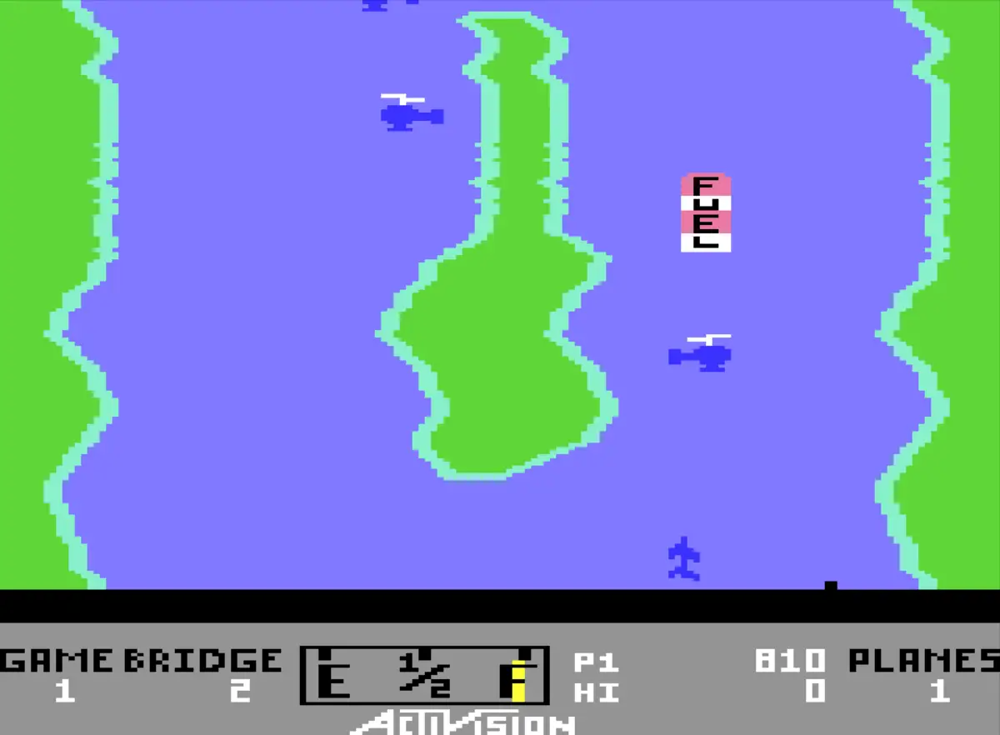

# River Raid

A standalone desktop port of the Commodore 64 game River Raid, built with
C++20 and SDL3.

Fly along the river, destroy enemy targets, refuel and survive the next bridge.



## Play

Download a [nightly build](https://github.com/Haehnchen/c64-river-raid/releases/tag/nightly)
for Linux, Windows or macOS. Extract the bundled ZIP, then run `river_raid` on Linux,
`river_raid.exe` on Windows, or open `River Raid.app` on macOS.

For a source build, follow the instructions below, then run:

```sh
make run
```

Press F1 to open the options, use F3 to choose a game, then press F1 to play.
Use an arrow key or Space to launch the aircraft.

The game uses a 4:3 display in both windowed and fullscreen mode, with black bars
where needed. Switching away from the window pauses play and releases controls.

## Controls

| Key | Action |
| --- | --- |
| F1 | Open options / start a game; restart outside active flight |
| F3 | Select the next course/player option outside flight |
| Arrow keys | Steer / change speed |
| Space | Fire |
| F11 | Toggle fullscreen / window |
| Escape | Quit |

The first two joysticks act as player ports 1 and 2. Use axes 0/1 or hat 0 to
steer and button 0 to fire.

## Build from source

Requires a C++20 compiler, SDL3 development files, CMake 3.20+, Ninja,
Python 3 and Make. The executable uses the installed SDL3 runtime.

```sh
git clone https://github.com/Haehnchen/c64-river-raid.git
cd c64-river-raid
make doctor
make build
```

- `make run` starts the game.
- `make check` runs the tests.
- `make smoke` checks startup with dummy SDL drivers.
